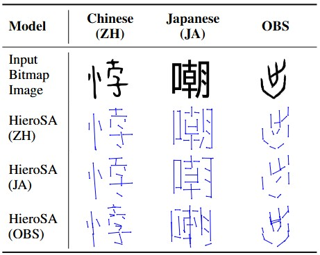

# HieroSA

[[📖 Paper](https://arxiv.org/abs/2601.05508)] [[🤗 HieroSA (Chinese)](https://huggingface.co/roufaen/HieroSA)]

## Introduction

We propose **HieroSA (Hieroglyph Stroke Analyzer)** 🏺, a framework for capturing stroke-level structural representations of hieroglyphic and logographic scripts. It automatically converts characters into normalized stroke-segment representations ✍️, without relying on handcrafted rules or script-specific priors.

HieroSA supports both modern logographic scripts and ancient hieroglyphs 🌍, enabling cross-lingual structural generalization. Experimental results demonstrate that it effectively captures character-level structure and semantics 🧩, providing a solid foundation for downstream analysis and understanding of hieroglyphic writing systems.

## Performance



## Environment Setup

This project is built on the [VERL](https://github.com/volcengine/verl) framework. Follow the commands below to set up the environment:

```bash
git clone https://github.com/THUNLP-MT/HieroSA && cd HieroSA
conda create -n HieroSA python=3.12
conda activate HieroSA
./scripts/install.sh
```

## Training

Prepare your image data in `JPG` or `PNG` format and place all images in a single directory. Run the following script to preprocess the data:

```bash
./scripts/prepare_data.sh
```

Download Qwen3-VL-4B-Instruct as the base model [here](https://huggingface.co/Qwen/Qwen3-VL-4B-Instruct), and start training with the following command:

```bash
./scripts/train.sh
```

## Evaluation

Prepare your image data in `JPG` or `PNG` format and place all images in a single directory.

Download the pretrained HieroSA (Chinese) checkpoint [here](https://huggingface.co/roufaen/HieroSA), and run inference with the following command:

```bash
./scripts/infer.sh
```

## Citation

If you find our work helpful for your research, please consider citing our work.

```plain
@article{luo2026hierosa,
    title={Enabling Stroke-Level Structural Analysis of Hieroglyphic Scripts without Language-Specific Priors}, 
    author={Fuwen Luo and Zihao Wan and Ziyue Wang and Yaluo Liu and Pau Tong Lin Xu and Xuanjia Qiao and Xiaolong Wang and Peng Li and Yang Liu},
    journal={arXiv preprint arXiv:2601.05508},
    year={2026}
}
```
